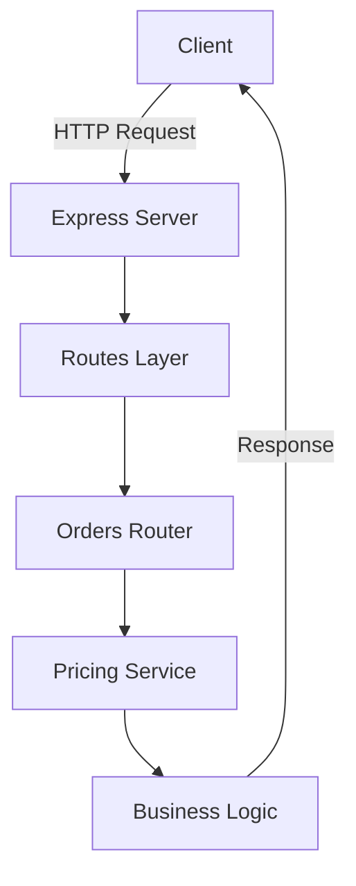

# 🚀 CodeBoost AI – Powered by IBM Bob

CodeBoost AI is a proof-of-concept project built for the IBM Bob Dev Day Hackathon.

It demonstrates how IBM Bob acts as an intelligent development partner to accelerate software delivery by automating key development tasks such as code understanding, documentation, testing, and refactoring.

---

## 🎯 Problem

Developers spend significant time on repetitive and non-value-added tasks:

* Understanding existing codebases
* Writing documentation
* Creating unit tests
* Refactoring legacy logic

These activities slow down development and reduce productivity.

---

## 💡 Solution

IBM Bob acts as an AI-powered development partner:

| Capability               | Benefit                        | Time Saved |
| ------------------------ | ------------------------------ | ---------- |
| 🧠 Context Understanding | Instant codebase comprehension | ~40%       |
| 📄 Auto-Documentation    | Always up-to-date docs         | ~30%       |
| 🧪 Test Generation       | Comprehensive coverage         | ~50%       |
| 🔧 Smart Refactoring     | Improved code quality          | ~35%       |

---

## 🏗️ Architecture

### System Overview



### Technology Stack

* Runtime: Node.js
* Framework: Express.js
* Architecture: Layered (Routes + Services)
* Data Storage: In-memory (demo only)

---

## 📡 API Endpoints

### POST /orders

Calculate total order price.

#### Example Request

```json
{
  "items": [
    { "type": "A", "price": 100 },
    { "type": "B", "price": 200 }
  ]
}
```

#### Example Response

```json
{
  "total": 332.1
}
```

---

## 🧪 Testing

Unit tests were generated using IBM Bob to validate pricing logic.

Covered scenarios:

* Empty input
* High-value discounts
* Unknown item types

---

## 🔧 Code Improvements

IBM Bob identified and improved:

* Code readability
* Hardcoded logic
* Maintainability issues
* Structure of pricing logic

---

## 📂 Project Structure

```
codeboost-ai/
├── app.js
├── package.json
├── routes/
│   └── orders.js
├── services/
│   └── pricing.js
├── bob_sessions/
└── README.md
```

---

## ▶️ How to Run

```bash
npm install
npm start
```

Server runs at:
http://localhost:3000

---

## 📈 Impact

Using IBM Bob:

* ⏱️ Reduced development time
* 📊 Improved code quality
* 🚀 Faster onboarding
* 🔄 Automated repetitive tasks

---

## 🏆 Hackathon Submission

This project demonstrates:

* AI-assisted development using IBM Bob
* Automated documentation
* Code improvement and refactoring
* Test generation

---

## 🏁 Conclusion

CodeBoost AI shows how IBM Bob can transform the developer experience by turning ideas into working software faster, with better quality and less effort.


Built with ❤️ and IBM Bob